# The Senior Engineer Playbook

**Cloud · DevOps · SRE · Platform · Security · AI Infrastructure**
**RAG · MCP · Agents · LLMOps · System Design**

*Learn how production systems actually work — then learn how to debug and design them.*

**Learn → Debug → Design → Lead**

⭐ Star it to save it · 🍴 Fork it to build your own interview notebook · 📥 Clone it for offline learning

---

## Repository at a glance

*Real counts, generated from repository contents — not marketing numbers. Run
`python scripts/validate-content.py` yourself to reproduce these.*

| | |
|---|---|
| 📚 Fundamentals Q&A (canonical `fundamentals.md`/`questions.md` files) | **46** |
| 🎯 Senior/staff scenarios (canonical `senior-scenarios.md` files) | **29** |
| 🔧 Troubleshooting scenarios (canonical `troubleshooting.md` files) | **25** (Kubernetes) |
| 🏗️ Architecture flows | **6** (Kubernetes: 3, RAG: 3) |
| ✅ Domains at full 25+/25+/25+/3+ depth | **Kubernetes** — the rest are starter-depth, see [ROADMAP.md](ROADMAP.md) |
| 🧩 Full system-design case studies | **3** (secrets platform, MCP gateway, internal developer platform) |
| 📄 Markdown documents, repository-wide | **80+** |

*The validator only counts content in the canonical filenames
(`fundamentals.md`, `questions.md`, `senior-scenarios.md`,
`troubleshooting.md`) — several domains currently have real content under
other filenames (e.g. `system-design/backend/principles.md`) that isn't
reflected in these specific numbers yet. That inconsistency is itself
tracked in [ROADMAP.md](ROADMAP.md) as a cleanup item, not hidden.*

> This is an honest, growing snapshot — not a finished 1,500-question
> repository yet. See [ROADMAP.md](ROADMAP.md) for the phased plan toward
> full depth per domain, and the note at the bottom of this README for why
> that's the deliberate approach.

---

## What this is

Most interview-prep material stops at definitions: *what is a pod, what is
a VPC, what is RAG.* Definitions get you through a screening call. They
don't tell an interviewer — or you, six months into the job — how to
actually reason about a production system under real constraints.

This repository pairs a fundamentals layer with senior/staff-level
**scenario, troubleshooting, and architecture** material that forces
trade-off reasoning: cost vs. reliability, blast radius vs. velocity,
security boundary vs. developer experience.

---

## What would you do?

> Your Kubernetes Pods are `Running`, but users receive `503`. Where do you
> start? → [`kubernetes/troubleshooting.md`](kubernetes/troubleshooting.md#lab-3-kubectl-reports-ingress-is-healthy-but-requests-return-503)

> Your RAG retriever finds the correct document but the model still
> hallucinates. Why? → [`ai-engineering/rag/questions.md`](ai-engineering/rag/questions.md)

> A container has an 8 GiB Kubernetes memory limit, and a child process
> group inside it sets `memory.max=6G`. Which limit actually triggers
> first? → [`kubernetes/senior-scenarios.md`](kubernetes/senior-scenarios.md#s1-a-container-has-an-8-gib-kubernetes-memory-limit-inside-it-the-application-spawns-a-child-process-group-with-memorymax6g-in-its-own-cgroup-v2-subtree-walk-through-exactly-what-happens-as-memory-usage-climbs-and-who-gets-oom-killed)

> An AI agent successfully authenticates to an MCP server but invokes a
> tool it shouldn't have access to. Where did authorization actually fail?
> → [`ai-engineering/mcp/security.md`](ai-engineering/mcp/security.md)

Each of those has a full, reasoned answer waiting — not a one-liner.

---

## Choose your path

| Path | Route through the repository |
|---|---|
| 🟢 **Starting out** | [`foundations/linux/`](foundations/linux/README.md) → [`foundations/git/`](foundations/git/README.md) → [`foundations/containers/`](foundations/containers/README.md) → [`kubernetes/`](kubernetes/README.md) |
| 🔵 **DevOps** | Linux → [`platform-engineering/gitops-and-cicd/`](platform-engineering/gitops-and-cicd/README.md) → [`kubernetes/`](kubernetes/README.md) → [`platform-engineering/observability/`](platform-engineering/observability/README.md) |
| 🟠 **SRE** | See the full curated path: [`docs/learning-paths/senior-sre.md`](docs/learning-paths/senior-sre.md) |
| 🟣 **Platform Engineer** | See the full curated path: [`docs/learning-paths/platform-engineer.md`](docs/learning-paths/platform-engineer.md) |
| 🤖 **AI Platform Engineer** | See the full curated path: [`docs/learning-paths/ai-platform-engineer.md`](docs/learning-paths/ai-platform-engineer.md) |
| 🔐 **AI Security Engineer** | [`ai-engineering/ai-security/`](ai-engineering/ai-security/README.md) → [`ai-engineering/mcp/security.md`](ai-engineering/mcp/security.md) |
| 🔴 **Staff / Principal** | [`kubernetes/senior-scenarios.md`](kubernetes/senior-scenarios.md) → [`system-design/case-studies/`](system-design/case-studies/README.md) → [`senior-scenarios/`](senior-scenarios/README.md) |

More paths land as content depth grows — see [`docs/learning-paths/`](docs/learning-paths/README.md).

---

## The engineering universe

How the domains in this repository actually relate to each other:

## Repository structure

| Folder | Subfolders |
|---|---|
| `ai-engineering/` | `agents-and-agentic-ai`, `ai-infrastructure`, `ai-platform-engineering`, `ai-security`, `context-engineering`, `evals`, `foundations`, `llm`, `llmops-and-mlops`, `mcp`, `rag`, `vector-databases` |
| `architecture/` | `rag` |
| `architecture-challenges/` | `architecture`, `assets` |
| `assets/` | `orbit-assets`, `topics` |
| `challenges/` | `debug-this`, `design-this` |
| `cheatsheets/` | — |
| `cloud/` | `architecture`, `assets`, `aws`, `azure`, `gcp` |
| `docs/` | `architecture`, `glossary`, `interview-strategy`, `learning-paths` |
| `forward-deployed-engineering/` | `architecture`, `assets` |
| `foundations/` | `containers`, `databases`, `distributed-systems`, `git`, `linux`, `networking` |
| `incidents/` | `ai`, `database`, `kubernetes`, `networking`, `observability`, `security` |
| `interview-question-bank/` | `architecture`, `assets` |
| `kubernetes/` | `architecture` |
| `mental-models/` | — |
| `platform-engineering/` | `devsecops-and-cloud-security`, `finops`, `gitops-and-cicd`, `internal-developer-platforms`, `observability`, `sre` |
| `request-journeys/` | `agent-to-mcp-tool`, `browser-to-kubernetes`, `commit-to-production`, `prompt-to-rag-response` |
| `scripts/` | — |
| `senior-scenarios/` | `architecture`, `assets` |
| `system-design/` | `backend`, `case-studies`, `frontend` |
| `templates/` | — |
| `tradeoffs/` | — |
| `troubleshooting-labs/` | `architecture`, `assets` |

## Content format

Every content type in this repository follows a fixed template, so the
depth is consistent no matter which folder you're in — see
[`templates/`](templates/README.md) for the exact structure of a
fundamentals question, a troubleshooting scenario, a senior/staff scenario,
and an architecture deep-dive.

For the repository-wide naming convention and canonical topic tree, see
[`docs/repository-structure.md`](docs/repository-structure.md).

## Architecture spotlight

**Enterprise AI Platform** — one AI control plane serving an entire
organization's model/RAG/agent/MCP traffic through a single governed
gateway:

Full worked version:
[`system-design/case-studies/design-an-enterprise-mcp-gateway.md`](system-design/case-studies/design-an-enterprise-mcp-gateway.md).

## Engineering Orbit

## Using this repository

- **New to a domain?** Start with that domain's fundamentals, then move to
  senior scenarios once fundamentals are solid.
- **Prepping for a specific interview?** Use the path table above or
  [`docs/learning-paths/`](docs/learning-paths/README.md) rather than
  reading every folder linearly.
- **Practicing live troubleshooting?** [`kubernetes/troubleshooting.md`](kubernetes/troubleshooting.md)
  and [`troubleshooting-labs/`](troubleshooting-labs/README.md) are written
  symptom-first — resist jumping to the answer.
- **Practicing whiteboard/architecture rounds?** [`system-design/case-studies/`](system-design/case-studies/README.md).
- **Want interview-strategy advice, not more technical content?** [`docs/interview-strategy/`](docs/interview-strategy/README.md).

## Project status & how it's maintained

This repository is **currently maintained as a curated learning resource**
by a single author. Feel free to star, fork, and use the material for
learning — that's exactly what it's for. **External content contributions
are not currently being accepted** (see [CONTRIBUTING.md](CONTRIBUTING.md)
for the full policy and how to report a technical issue instead).

See [ROADMAP.md](ROADMAP.md) for the phased build-out plan, and
[CHANGELOG.md](CHANGELOG.md) for what's actually shipped so far.

> **A note on how this repository is built:** given the scope of a full
> 2026 interview handbook, content is added in deliberate, honest passes —
> real, complete answers in every domain rather than padding toward a
> target count with shallow filler. Kubernetes, AI/MCP/Agentic AI, and
> System Design went deepest first (see the stats table above for current,
> real counts); every other domain has genuine starter content and is
> being brought to full depth incrementally per the roadmap.

## License

See [LICENSE](LICENSE) (MIT). For the reasoning behind that choice — and
what it does and doesn't protect against fork misuse — see
[`docs/licensing-options.md`](docs/licensing-options.md).
