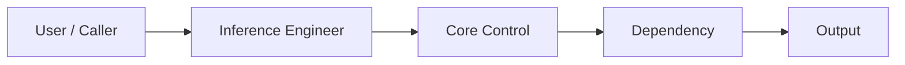

# Inference Engineer — Basic Flow

## Purpose

This architecture shows how inference engineer thinking evolves from a minimal flow into an operable production design.

## Components

- Ingress
- inference gateway
- batcher
- runtime

## Flow




## Deployment notes

- Define the first control boundary before scaling the workflow.
- Attach identity, policy, and telemetry early rather than retrofitting them after the first incident.
- Keep rollback and ownership visible in the design, not implicit.

## Commands / configuration

```bash
kubectl get deploy -A
kubectl get svc -A
curl -vk https://service.internal/readyz
```

```yaml
kind: Deployment
metadata:
  name: inference-engineer-01
spec:
  replicas: 2
```

## Observability

- Trace every cross-boundary handoff.
- Publish latency, success, and dependency health metrics.
- Keep audit context attached to high-risk operations.

## Security

- Enforce least privilege for every actor in the path.
- Separate tenant and environment boundaries clearly.
- Store secrets and policy outside mutable application code.

## Failure points

- Dependency drift
- Missing policy checks
- Latency buildup across retries or long-running workflows
- Ambiguous ownership during incidents

## Learning outcomes

By studying this flow, the learner should be able to explain the architecture, the likely failure boundaries, and the trade-offs behind the production shape.
