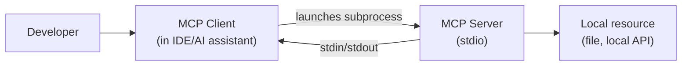

# Local MCP Client-Server (stdio)

**Problem:** The minimal case — a single developer's AI assistant using a
locally-run tool, with no network/enterprise concerns yet.

**Requirements:** Client can discover and invoke tools from a locally-
launched server process.

**Assumptions:** Single user, single machine, implicit trust in
whatever's launched (per `fundamentals.md` Q3).

## Diagram

## Flow explanation

The client launches the server as a local subprocess and communicates
over stdin/stdout. On connect, the initialization handshake (per
`fundamentals.md` Q7) advertises the server's tools/resources/prompts.
The model, via the client, invokes tools directly — no network hop, no
authentication beyond "this process was launched by a trusted local
client."

## Components

- **Client**: embedded in the developer's AI assistant/IDE.
- **Server**: a local process, typically short-lived (per this session).
- **Local resource**: whatever the server's tools actually touch — a
  file, a local database, a local API.

## Identity, authentication, authorization

None, by design — trust derives entirely from the local launch decision
(per `fundamentals.md` Q3). This is appropriate *only* at this scope; see
[02](02-enterprise-mcp-gateway.md) for what changes once multiple users/
a network boundary are introduced.

## Security

Sandboxing (per `fundamentals.md` Q14) is the main lever available here,
since there's no network-layer authentication to add. No tool-poisoning
review process is strictly required at this scale, but is still good
practice per `security.md`.

## Scaling / Reliability

Not applicable at this scope — single user, single session, no
concurrent-load concerns.

## Trade-offs

Zero setup/infrastructure cost, appropriate for individual developer
tooling. Explicitly not appropriate once multiple users or genuinely
sensitive data are involved — see 02/03 for what actually changes.

## Interview questions

1. What's the single biggest security assumption this architecture
   relies on, and when does it stop being valid?
2. What would break first if you tried to scale this pattern to a team
   of 50 people sharing one server instance?
