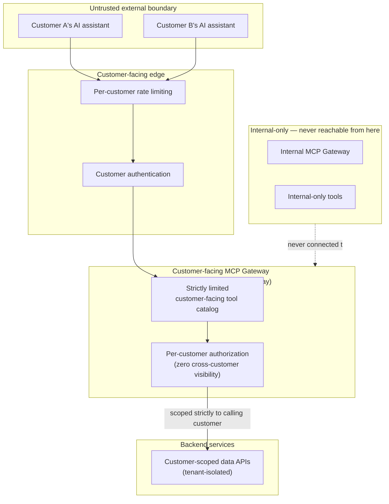

# Multi-Tenant, Customer-Facing Secure MCP Platform

**Problem:** Expose MCP-based AI tooling to external, mutually-untrusting
customers (not internal employees) — the architecture named in
`senior-scenarios.md` S20, given full diagram treatment here.

**Requirements:** Strict per-customer isolation, aggressive rate
limiting per external identity, zero cross-customer data visibility, a
strictly limited customer-facing tool catalog distinct from the full
internal one.

**Assumptions:** Builds on
[02-enterprise-mcp-gateway.md](02-enterprise-mcp-gateway.md)'s
foundation, with every component's trust assumptions revisited for an
external, adversarial-by-default customer base.

## Diagram

## Flow explanation

A customer's AI assistant authenticates at the edge (per-customer
identity, not a shared credential). Rate limiting applies per-customer
before any request reaches the gateway proper — protecting against one
customer's runaway usage affecting others, per the circuit-breaker
isolation reasoning in `senior-scenarios.md` S15, applied to rate
limiting instead of failure handling. The gateway presents only the
strictly-limited customer-facing catalog (never the full internal one),
and every authorization check scopes data access to *only* the
authenticated customer's own data — enforced at the backend API layer
too (defense in depth), not trusted to the gateway alone.

## Components

- **Customer-facing gateway**: architecturally **separate** from the
  internal employee-facing gateway in
  [02](02-enterprise-mcp-gateway.md) — not the same instance with
  different auth, a genuinely distinct deployment, so a misconfiguration
  in one cannot leak into the other's trust boundary.
- **Customer-scoped APIs**: backend services that enforce tenant
  isolation independently of the gateway's own authorization — defense
  in depth against a gateway-layer authorization bug.

## Identity, authentication, authorization

Per-customer identity, never shared credentials. Authorization scoped to
zero cross-customer visibility by default — the discovery-scoping
defense-in-depth principle (`fundamentals.md` Q15) matters especially
here, since even *seeing* that another customer's data/tools exist is
itself a disclosure this architecture must prevent.

## Networking

The customer-facing gateway has **no network path** to the internal
gateway or internal-only tools — not just an authorization boundary, an
actual network-segmentation boundary, mirroring the egress-control
enforcement in `kubernetes/senior-scenarios.md` S15.

## Security

Every principle from `security.md` applies with the volume/adversarial
assumption turned up — external customers should be treated with the
same rigor as the untrusted-arbitrary-code tenant class in
`kubernetes/senior-scenarios.md` S5, not the lighter internal-team trust
model.

## Observability

Full audit logging per customer identity — both for security forensics
(S4) and because a customer-facing product likely has contractual/SLA
obligations around data handling that this log is the evidence for.

## Scaling

Per-customer rate limiting (S8's cost-control reasoning, applied to
abuse-prevention here) is what keeps this tractable at genuine customer
volume — without it, one customer's usage pattern could degrade service
for every other customer sharing the platform.

## Failure modes

A cross-customer data leak here is a severe incident (contractual/legal
exposure, not just an internal inconvenience) — this architecture's
entire design center is preventing that specific failure mode through
layered, redundant isolation (gateway authorization + backend API
enforcement + network segmentation from internal systems), not relying
on any single layer.

## Trade-offs

Full architectural separation from the internal gateway costs real
duplicate infrastructure/maintenance versus a single shared gateway with
"just" different auth policies — justified here because the blast radius
of a shared-gateway misconfiguration (an internal-tool leak to an
external customer) is severe enough to warrant paying for genuine
isolation rather than relying on configuration correctness alone.

## Interview questions

1. Why does this architecture use a fully separate gateway deployment
   rather than the same gateway with stricter policy for customer
   traffic?
2. What's the specific failure mode this design prevents that a shared-
   gateway-with-policy approach wouldn't reliably prevent?
3. How would you extend this design if a customer legitimately needs a
   custom tool built specifically for their account — how does that fit
   the strictly-limited-catalog principle?
