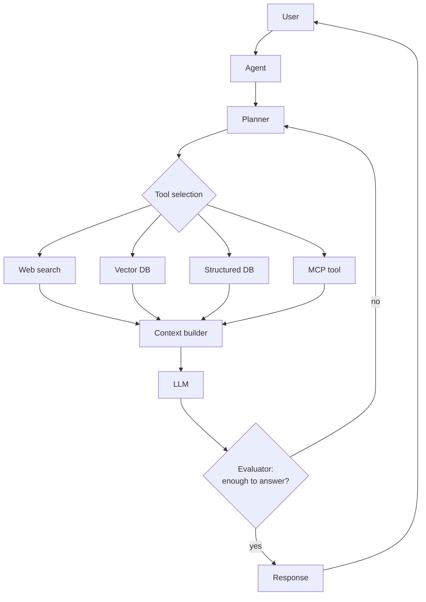

# Agentic RAG

**Problem:** A fixed retrieve-then-generate pipeline can't handle
questions that need multiple retrieval rounds, retrieval from different
sources depending on the question, or reasoning about whether the
retrieved content is actually sufficient before answering.

**Requirements:** Everything in [enterprise-rag.md](enterprise-rag.md)'s
authorization/quality/observability requirements, plus: the ability to
retrieve iteratively, from multiple heterogeneous sources, with the
system itself deciding when it has enough information to answer.

**Assumptions:** Builds directly on the enterprise flow's authorization
and observability foundations — this document focuses on what's
*different* about the retrieval strategy itself, not on re-explaining
authorization.

## Architecture diagram

## Request flow

1. The **Agent** receives the user's question and hands it to a
   **Planner**, which decides what information is needed — this is the
   fundamental shift from the enterprise flow: retrieval is no longer a
   fixed pipeline stage that always runs the same way, it's a **decision**
   the system makes.
2. **Tool selection** picks the appropriate source(s) for this specific
   question — a vector DB for conceptual/document questions, a structured
   database for a factual lookup, live web search for time-sensitive
   information, or an MCP tool for anything requiring an external
   action/API (see [`ai-engineering/mcp/`](../../ai-engineering/mcp/README.md)).
3. The **Context builder** assembles whatever's been retrieved so far.
4. The LLM attempts an answer, but critically, an **Evaluator** step
   checks whether the retrieved context was actually sufficient — if not,
   control returns to the **Planner** for another retrieval round
   (potentially from a different source, or a refined query against the
   same source), rather than generating a low-confidence answer from
   insufficient information.
5. Only once the evaluator is satisfied does the response return to the
   user.

## How this differs from conventional RAG

The enterprise flow's retrieval step always runs exactly once, always
against the same vector DB, and always feeds directly into generation.
Agentic RAG makes **three things dynamic that were previously fixed**:
*whether* to retrieve again, *where* to retrieve from, and *when* enough
information has actually been gathered. This directly trades the
enterprise flow's predictable latency/cost (one retrieval round, always)
for the ability to correctly answer questions a fixed single-round
pipeline structurally cannot — multi-hop questions requiring information
from more than one source, or questions where the right source isn't
knowable in advance.

## Security

Everything from [enterprise-rag.md](enterprise-rag.md) still applies
(authorization at retrieval time), **plus** the agent-specific
tool-authorization concerns from
[`ai-engineering/mcp/security.md`](../../ai-engineering/mcp/security.md)
— since tool selection here is a model decision, not a fixed pipeline
step, the same "authorization must be enforced outside the model's own
reasoning" principle applies to *every* tool/source this agent can reach,
not just the vector DB.

## Failure modes

- **Unbounded retrieval loops**: without a hard cap on evaluator-triggered
  re-planning rounds, a genuinely unanswerable or ambiguous question can
  cause the agent to loop indefinitely, retrieving repeatedly without
  converging — needs an explicit max-iteration bound with a defined
  "answer with available information and flag uncertainty" fallback.
- **Evaluator miscalibration**: an evaluator that's too lenient defeats
  the entire point (accepts insufficient context, same failure mode as
  the basic flow); one that's too strict burns cost/latency on
  unnecessary additional retrieval rounds for questions that were already
  answerable.

## Trade-offs

Higher latency and cost per query (potentially several retrieval rounds
and LLM calls instead of one) in exchange for correctly handling a class
of question the enterprise flow cannot answer at all, regardless of how
well-tuned its single-round retrieval is. Not worth the added complexity
and cost if your actual query distribution is dominated by
single-source, single-hop questions the enterprise flow already handles
well.

## Interview questions

1. How would you bound the number of retrieval rounds to prevent runaway
   cost on a genuinely unanswerable question?
2. How would the evaluator actually decide "enough information" — what
   would that check concretely look like?
3. How does tool authorization for this architecture differ from a
   human-driven MCP session (per the MCP gateway case study)?
4. When would you deliberately choose enterprise RAG over agentic RAG,
   given agentic RAG seems strictly more capable?
