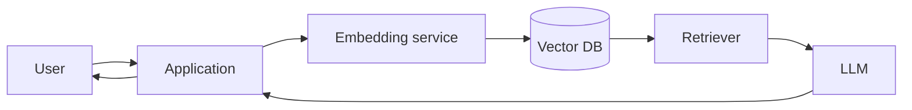

# Basic RAG

**Problem:** Ground an LLM's answers in a specific corpus of documents it
wasn't trained on (or that changes more often than retraining is
practical), instead of relying solely on the model's parametric knowledge.

**Requirements:** Answer user questions using content from a defined
document set; keep the corpus updatable without retraining anything.

**Assumptions:** Single corpus, single model, no multi-tenancy or
per-user access control yet — those are exactly what
[enterprise-rag.md](enterprise-rag.md) adds.

## Architecture diagram

## Request flow

1. User submits a question to the application.
2. The application sends the question to the **embedding service**,
   converting it into a vector representation.
3. That vector is used to query the **vector DB** for the most similar
   stored document chunks (which were embedded and indexed ahead of time,
   during ingestion — not shown in this basic flow, but happens
   continuously/on-schedule).
4. The **retriever** returns the top-k matching chunks.
5. The application assembles a prompt containing the user's question plus
   the retrieved chunks as context, and sends it to the **LLM**.
6. The LLM's response — grounded in the retrieved content — is returned to
   the user.

## Components

- **Embedding service**: converts text to vectors, consistently for both
  ingestion-time documents and query-time questions (same model, or the
  retrieval quality degrades badly — see the follow-up question below).
- **Vector DB**: stores document chunk embeddings, serves nearest-neighbor
  queries. See [`ai-engineering/vector-databases/`](../../ai-engineering/vector-databases/README.md).
- **Retriever**: the query logic — top-k similarity search, in this basic
  flow with no reranking or hybrid search yet.
- **LLM**: generates the final answer from the assembled context.

## Security

Basic flow has essentially none defined yet — no per-user access control
on which documents can be retrieved, no authentication on the application
layer. Acceptable for a single-tenant internal tool over non-sensitive
content; not acceptable for anything with mixed-sensitivity documents or
multiple users with different access levels — see
[enterprise-rag.md](enterprise-rag.md).

## Failure modes

- **Embedding model mismatch**: if the query-time embedding model differs
  even slightly from the ingestion-time one (a version upgrade applied to
  one but not the other), retrieval quality silently degrades — vectors
  from different model versions aren't reliably comparable.
- **Stale index**: if ingestion doesn't run frequently enough, the vector
  DB serves outdated content confidently, with the LLM having no way to
  know it's stale.

## Trade-offs

Simplicity vs. everything [enterprise-rag.md](enterprise-rag.md) adds —
this flow is the right starting point for prototyping or a genuinely
single-tenant, low-stakes use case, and the wrong architecture to ship
as-is for anything with real users, access control needs, or quality
requirements beyond "roughly works."

## Interview questions

1. What happens if the embedding model used at query time differs from
   the one used at ingestion time?
2. How would you keep the vector DB's index fresh as source documents
   change?
3. What's missing from this flow that you'd need before shipping it to
   real users?
