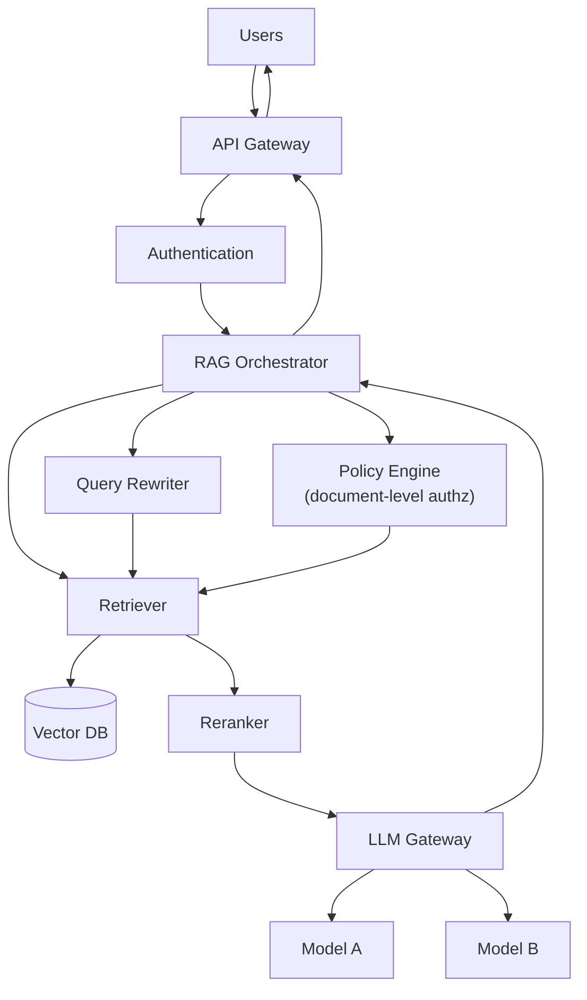

# Enterprise RAG

**Problem:** Serve RAG-backed answers across an organization, where
documents have different sensitivity/access levels per user, quality bars
are high enough to need reranking, and the system needs to be observable,
cacheable, and cost-controlled at real scale.

**Requirements:** Everything in [basic-rag.md](basic-rag.md), plus:
per-user authorization on retrieved content, query quality improvements
(rewriting, reranking), multi-model routing, caching, and full
observability.

**Assumptions:** An existing org identity provider; a document corpus with
per-document access-control metadata already captured at ingestion time.

## Architecture diagram

## Request flow

1. User request hits the **API Gateway**, which enforces **authentication**
   before anything else happens.
2. The **RAG Orchestrator** coordinates the rest of the pipeline — this is
   the component that didn't exist in the basic flow; it's what makes
   the additional stages below composable rather than a rigid linear
   chain.
3. The **Query Rewriter** may reformulate the user's question (expanding
   abbreviations, generating multiple query variants for multi-query
   retrieval) before it reaches the retriever.
4. The **Retriever** queries the vector DB, but critically, results are
   filtered through the **Policy Engine** — a chunk the requesting user
   isn't authorized to see is excluded **before** it ever reaches the
   LLM, not filtered out of the final answer after the fact (which would
   already have leaked the content into the model's context).
5. The **Reranker** reorders the authorized candidate chunks by actual
   relevance (a more expensive, more accurate model than the initial
   retrieval's similarity search) before the top few are kept.
6. The **LLM Gateway** routes the final request to an appropriate backend
   model (see [`ai-engineering/llm/questions.md`](../../ai-engineering/llm/questions.md)
   for the model-routing trade-offs) and returns the response back up the
   chain to the user.

## Security

**Document-level authorization is enforced at retrieval time, not
post-hoc** — this is the single most important security property of this
architecture, and the main thing that changes versus the basic flow. A
common, serious mistake: retrieving without authorization filtering and
only checking permissions before *displaying* the final answer — by then,
unauthorized content has already been sent to the LLM as context and may
influence or leak into the response regardless of display-layer
filtering.

## Observability

Full request tracing across every stage (rewrite → retrieve → rerank →
generate) so a bad answer can be attributed to a specific stage, per the
troubleshooting reasoning in
[`ai-engineering/rag/questions.md`](../../ai-engineering/rag/questions.md).
Per-model cost and latency tracked separately through the LLM gateway.

## Caching

Query results (and potentially full responses, for exact-repeat or
semantically-similar queries — see the semantic-caching risk discussion in
[`ai-engineering/llm/questions.md`](../../ai-engineering/llm/questions.md))
cached to reduce redundant retrieval/generation cost at organizational
scale, where the same or similar questions are asked repeatedly across
many users.

## Scaling

Every stage (rewriter, retriever, reranker, LLM gateway) scales
independently — this is a direct benefit of decomposing the basic flow's
single linear pipeline into distinct, horizontally-scalable services
behind the orchestrator, rather than one monolithic RAG service.

## Failure modes

- **Reranker becomes the bottleneck**: reranking models are typically
  more expensive per-item than initial retrieval; a poorly-bounded
  candidate set (too many chunks passed to the reranker) can dominate
  end-to-end latency.
- **Policy engine staleness**: if a user's access is revoked but the
  policy engine's cache hasn't caught up, previously-authorized content
  may still be retrievable — same class of risk as the authorization
  staleness issue discussed for the secrets-management platform and MCP
  gateway case studies.

## Trade-offs

Meaningfully more operational complexity and more services to run/monitor
than the basic flow, in exchange for the authorization, quality, and cost
controls that make this actually viable to run across an organization
with mixed-sensitivity content and many concurrent users. Not worth
building this if [basic-rag.md](basic-rag.md)'s simpler shape genuinely
meets the requirements (single-tenant, low-stakes, low-scale).

## Alternative architecture

A simpler middle ground: skip the dedicated reranker and query rewriter,
keep only the policy-engine authorization addition from the basic flow —
appropriate when quality is "good enough" from initial retrieval alone but
authorization is still a hard requirement (common for internal tools with
sensitive-but-not-adversarial content).

## Interview questions

1. Why is retrieval-time authorization safer than filtering the final
   answer for authorized content after generation?
2. How would you decide how many candidate chunks to pass to the
   reranker, given rerankers are typically much more expensive
   per-item than the initial retrieval step?
3. How would you detect that the policy engine's authorization cache has
   gone stale relative to a recent permission change?
4. What's the cost/latency trade-off of query rewriting — when does it
   pay for itself?
