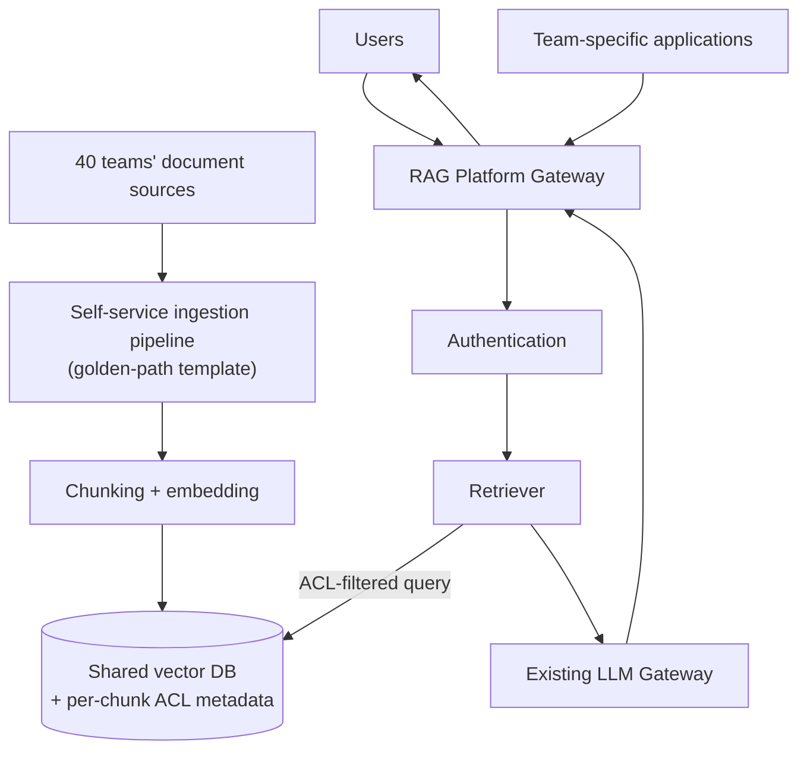

# Reference Solution

## Architecture

## Key decisions

**One shared vector DB, not 40 per-team indexes**, with **per-chunk ACL
metadata captured at ingestion time** (not a separate lookup system) —
every chunk carries the authorization data needed to filter it at query
time, directly in the vector DB's metadata. This is the central design
choice: it avoids the "which of 40 indexes do I even query" problem
entirely, and makes retrieval-time authorization (same pattern as
`enterprise-rag.md`) a metadata filter on a single query rather than a
federated fan-out across 40 separate systems.

**Self-service ingestion via a golden-path template**, not a bespoke
integration per team — mirrors the internal-developer-platform pattern:
teams provide their document source and required ACL metadata mapping
(who's authorized to see this content, sourced from the org's existing
identity/permission system, not a new bespoke permission model per team),
and the platform handles chunking, embedding, and indexing consistently.
This is what avoids the central team becoming a bottleneck — the *template*
is centrally built and maintained, but *using* it is self-service.

**A single platform gateway**, not per-team query endpoints — consistent
authentication, authorization enforcement, cost attribution, and
observability for every query, regardless of which team's content ends
up being retrieved for a given question. Team-specific applications can
still be built on top (a team's own chat UI, for instance) but they all
route through this shared gateway rather than reimplementing retrieval
themselves.

## Trade-offs named

- **Shared vector DB vs. per-team indexes**: shared is right here because
  the actual requirement is cross-team-relevant answers with correct
  authorization — federated per-team indexes would make that harder, not
  easier, despite feeling like better isolation. The cost: the shared
  index becomes a scaling and blast-radius concern for the whole
  platform, same trade-off named in the Secrets Management Platform case
  study.
- **Golden-path ingestion vs. full self-service freedom**: constrains
  what teams *can* onboard (must fit the template's chunking/ACL-mapping
  model) in exchange for consistency and avoiding 40 bespoke, likely
  inconsistently-secured integrations — the same golden-path tension
  discussed in the IDP case study.

## Where this connects to other material in the repository

- Authorization pattern: [`architecture/rag/enterprise-rag.md`](../../../architecture/rag/enterprise-rag.md)
- Self-service platform pattern: [`system-design/case-studies/design-an-internal-developer-platform.md`](../../../system-design/case-studies/design-an-internal-developer-platform.md)
- Gateway-enforced authorization principle: [`ai-engineering/mcp/senior-scenarios.md`](../../../ai-engineering/mcp/senior-scenarios.md)
