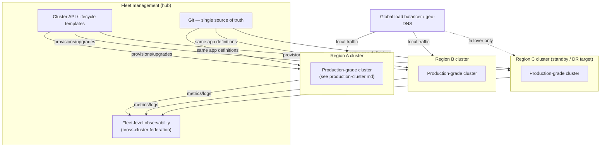

# Multi-Region, Multi-Cluster Platform

**Problem:** Show the fleet-scale architecture referenced throughout
`kubernetes/senior-scenarios.md` (S2's 120-cluster fleet, S14's
active-active design, S4's DR design) as one integrated picture.

**Requirements:** Independent per-region clusters, centralized fleet
lifecycle management, cross-region DR/failover, fleet-level
observability.

**Assumptions:** Builds directly on
[production-cluster.md](production-cluster.md) — each region here *is*
that single-cluster architecture, replicated.

## Architecture diagram

## Request flow

A user's request hits the **global load balancer**, which geo-routes to
the nearest healthy region's cluster — normal operation never involves
the standby region. Each regional cluster is internally the full
production architecture from [production-cluster.md](production-cluster.md)
— this diagram deliberately doesn't repeat that internal detail, per the
"builds on" assumption above.

## Components

- **Cluster API / lifecycle templates**: per `kubernetes/senior-scenarios.md`
  S2 — clusters are provisioned/upgraded from templates, not hand-built,
  making "add a region" or "upgrade the fleet" (S6) tractable operations.
- **Git as single source of truth**: per S8's GitOps design — every
  region runs from the *same* application definitions, so the standby
  region (Region C here) is never a stale, drifted copy.
- **Fleet-level observability**: per S2 and S20's regional-outage
  scenario — a single view across all regions is what makes fast
  fleet-level triage possible during an incident, rather than checking
  each region's dashboards independently.
- **Global load balancer**: geo-routing for active-active regions (S14),
  with failover routing to the standby (Region C) only during a DR event
  (S4) — and, per S15, this routing must respect any data-residency
  restrictions on which regions are valid failover targets for which
  users.

## Reliability

This diagram intentionally shows **three** regions, not two, to make a
point: Region C here is a genuine DR target (per S4), separate from the
two active-active serving regions (per S14) — conflating "our DR target"
with "just another active region" undersells the deliberate design
choice of whether a given region is actively serving traffic or held in
reserve specifically for failover.

## Failure modes

- Losing Region A entirely: per S4/S20, traffic fails over — to Region B
  if active-active and healthy, or Region C if this is the designated DR
  path — with the specific mechanics depending on which design (S4 vs.
  S14) this fleet actually implements.
- Fleet management hub (Cluster API / GitOps source) unavailable: existing
  regional clusters continue serving traffic normally (this is
  control-plane-for-changes, not control-plane-for-serving) — but no
  fleet-wide lifecycle operations (upgrades, new region provisioning) can
  proceed until restored, mirroring the single-cluster control-plane
  availability discussion in `kubernetes/fundamentals.md` Q7.

## Trade-offs

Active-active (S14) versus active-passive-with-DR-standby (S4) is the
central trade-off this diagram has to pick a position on for any real
deployment — active-active gives better resource utilization (no idle
standby capacity) and lower-latency local serving everywhere, at the cost
of the genuinely hard cross-region write-conflict problem S14 names
explicitly; active-passive is simpler to reason about and implement
correctly, at the cost of paying for standby capacity that's normally
idle.

## Interview questions

1. How would you decide whether a given region in this diagram should be
   active-active or a passive DR standby?
2. What's different about how you'd test this architecture's failover
   compared to testing a single cluster's upgrade process?
3. How does S15's data-residency requirement change which regions are
   valid failover targets for which users, concretely, on this diagram?
