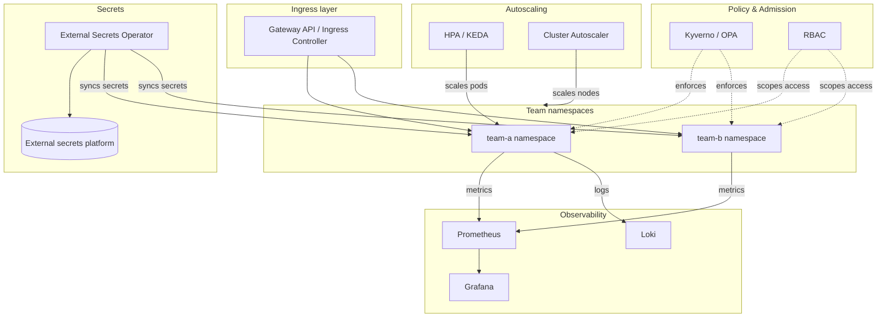

# A Production-Grade Single Cluster

**Problem:** Show the full component set a real production cluster
needs beyond the bare Kubernetes control plane — policy, secrets,
observability, ingress, autoscaling — as one integrated system.

**Requirements:** Multi-tenant (internal teams), policy-enforced,
observable, autoscaling, secure secret handling.

**Assumptions:** Single cluster/region — the multi-cluster/multi-region
picture is [multi-region-platform.md](multi-region-platform.md).

## Architecture diagram

## Components

- **Gateway API / Ingress**: per the Ingress-vs-Gateway-API fundamentals
  question — the single entry point for external traffic, routing to the
  correct team namespace.
- **Kyverno/OPA**: policy enforcement per the admission-controller
  fundamentals question — mandatory resource requests, non-root
  containers, required labels for cost attribution (per
  `platform-engineering/finops/README.md`), rolled out audit-first per
  `kubernetes/senior-scenarios.md` S7.
- **RBAC**: per-team namespace-scoped access via the ClusterRole +
  namespace-scoped RoleBinding pattern from
  `kubernetes/senior-scenarios.md` S17.
- **External Secrets Operator + external platform**: per the Secrets
  Management Platform case study — secrets never live natively as
  cluster Secrets with no external source of truth; ESO syncs from an
  external, properly-managed platform.
- **Prometheus/Grafana/Loki**: golden-signals observability (per
  `platform-engineering/sre/`), feeding both team-level dashboards and
  the fleet-level view referenced in the multi-cluster scenario.
- **HPA/KEDA + Cluster Autoscaler**: per the HPA/VPA fundamentals
  question and the CI-runner isolation scenario (S3) — pod-level and
  node-level autoscaling working together, not in conflict.

## Security

Multi-tenant isolation via the layered approach discussed across
`kubernetes/senior-scenarios.md` S3, S5, S17: namespace boundaries + RBAC
+ NetworkPolicy default-deny baseline + resource quotas, escalating to
stronger isolation (sandboxed runtimes, dedicated node pools) only for
higher-risk tenant classes.

## Failure modes

- Policy engine (Kyverno) unavailable → per Q15's failurePolicy
  discussion, blocks all matching object creation if `Fail` is
  configured — a real availability dependency, not just a policy
  concern.
- Secrets platform (external, via ESO) unavailable → existing synced
  secrets remain valid in-cluster; *new* secret provisioning/rotation
  blocks until restored — degraded, not a full outage, if ESO's sync
  interval already delivered current values.

## Trade-offs

Every additional platform component (policy engine, secrets sync,
observability stack) is itself a dependency the cluster now relies on —
per `kubernetes/senior-scenarios.md` S22's tuning-before-splitting
reasoning, adding platform complexity should be justified by genuine
multi-tenant/production requirements, not added reflexively to every
cluster regardless of actual need.

## Interview questions

1. Which of these components, if unavailable, degrade the cluster
   gracefully versus causing a hard outage?
2. How would you decide which of these are mandatory for every cluster
   versus optional based on the cluster's actual purpose (e.g. a small
   dev cluster)?
3. How does this diagram map onto the 40-team RBAC scenario (S17) and the
   CI-runner isolation scenario (S3) simultaneously — do they conflict?
