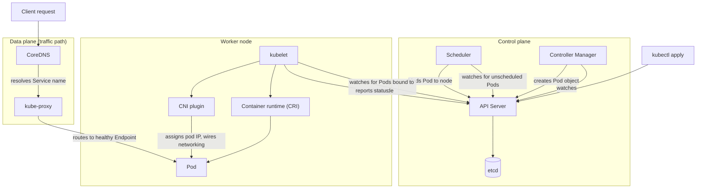

# Request Flow: From `kubectl apply` to a Running, Reachable Pod

**Problem:** Understand the complete path a change takes through
Kubernetes — both the control-plane path (getting an object created and
scheduled) and the data-plane path (that object's pod actually becoming
reachable) — as one coherent flow, not two separate topics.

**Requirements:** Trace both paths explicitly; show where each component
from `kubernetes/fundamentals.md` Q1, Q7-Q9 actually sits.

**Assumptions:** A single cluster, a Deployment + Service + Ingress
already existing; tracing what happens when a new pod is added (e.g. via
a scale-up).

## Architecture diagram

## Request flow

**Control-plane path (getting the pod to exist and be scheduled):**
1. `kubectl apply` → API server → etcd (per
   `kubernetes/fundamentals.md` Q1 and Q7).
2. Controller Manager's Deployment/ReplicaSet controllers create the Pod
   object.
3. Scheduler filters and scores nodes (per Q9), binds the pod to a
   specific node.
4. That node's kubelet notices the binding, instructs the CRI to pull the
   image and start the container, and the CNI plugin assigns pod
   networking.
5. kubelet reports status back through the API server.

**Data-plane path (a client actually reaching that pod):**
1. Client resolves the Service name via CoreDNS (per Q11) — resolves to
   the Service's stable virtual IP, not directly to any pod IP.
2. `kube-proxy` (or CNI-equivalent) routes the connection to one of the
   Service's healthy Endpoints — this step depends on the pod actually
   being `Ready` (per the liveness/readiness fundamentals question), not
   merely `Running`.

## Where each fundamentals question maps onto this diagram

- API server gatekeeping: Q7
- etcd/Raft: Q8
- Filtering/scoring: Q9
- Service DNS resolution: Q11
- Readiness gating Endpoints membership: Q5

## Failure modes

Both paths have entirely independent failure modes — a pod can be
perfectly scheduled and running (control-plane path succeeded) while
still unreachable (data-plane path broken, e.g. per
`kubernetes/troubleshooting.md` Lab 3's empty-Endpoints scenario). Debug
each path separately; per the
[Follow the Request](../../mental-models/follow-the-request.md) mental
model, don't assume success on one path implies success on the other.

## Interview questions

1. Why can a pod be `Running` and correctly scheduled, yet completely
   unreachable by clients?
2. What's the difference between what the scheduler does and what
   kube-proxy does — why are these separate concerns?
3. Walk through what breaks, specifically, if CoreDNS is down but
   kube-proxy is healthy.
