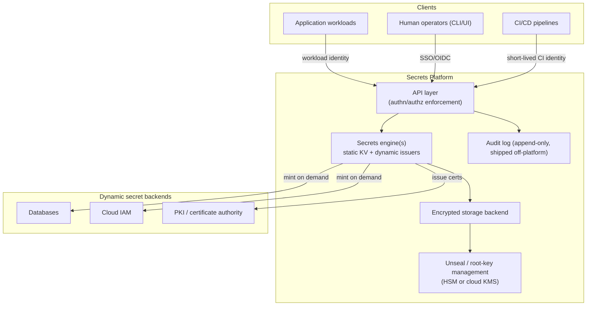

# Design a Secrets Management Platform

**DIFFICULTY:** 🟠 Senior
**ROLE:** Platform Engineer, DevSecOps, Cloud Security Engineer

## Requirements

**Functional:**
- Store and serve secrets (credentials, API keys, certificates) to
  applications and humans, with fine-grained access control.
- Support dynamic/short-lived secret issuance (e.g. database credentials
  minted per-request with a TTL), not just static key-value storage.
- Full audit trail of every read/write.
- Rotation — both scheduled and on-demand (e.g. after a suspected leak).

**Non-functional:**
- High availability — this sits on the critical path for every
  application's startup and many runtime operations; an outage here
  cascades broadly.
- Low read latency (applications fetching secrets at startup or per-request
  shouldn't meaningfully slow down).
- Strong confidentiality guarantees — encryption at rest and in transit,
  minimal blast radius if any single component is compromised.

## Scale estimate

Assume ~5,000 services across the org, each fetching a handful of secrets
at startup and occasionally during runtime (dynamic credential renewal) —
low-thousands of requests/second at peak, heavily read-skewed, with writes
(new secrets, rotations) orders of magnitude less frequent.

## High-level architecture

## Data model

- **Secret metadata**: path/name, engine type (static KV vs. dynamic),
  policy references, rotation schedule, creation/last-rotated timestamps.
  Metadata is **not** encrypted the same way secret values are — it needs
  to be queryable for operational purposes (rotation scheduling, audit
  queries) without decrypting every secret.
- **Secret value**: encrypted at rest, decrypted only in-memory at serve
  time, never written to disk unencrypted, never logged.
- **Policy**: maps an identity (or identity pattern) to allowed
  operations on a path pattern — the actual authorization model.
- **Lease** (for dynamic secrets): tracks issued credential, TTL, and
  renewal/revocation state — this is what makes short-lived credentials
  actually revocable before natural expiry.

## APIs

- `GET /v1/secret/<path>` — fetch a static secret (policy-checked).
- `POST /v1/<engine>/creds/<role>` — request dynamically-issued
  credentials (e.g. a DB username/password minted just for this caller,
  with a bounded TTL).
- `POST /v1/lease/revoke/<lease-id>` — explicit revocation before natural
  expiry (critical for incident response).
- `GET /v1/audit` — audit query interface (typically read by a SIEM
  ingestion pipeline, not queried ad-hoc in the hot path).

## Networking

- Internal-only by default — no public internet exposure. Applications
  reach it over the internal network, ideally through a service mesh with
  mTLS so the platform can cryptographically verify caller identity at the
  network layer in addition to the application-layer authn.
- Any remote/multi-region access uses the same workload-identity model,
  not a shared network-level secret (a static "network is trusted"
  boundary is not sufficient for something this sensitive).

## Security

- **Workload identity, not static credentials, for authentication** —
  applications authenticate using their platform-native identity (cloud
  IAM role, Kubernetes service account token) exchanged for a
  short-lived platform token, rather than embedding a static "master"
  credential to talk to the secrets platform (which would just relocate
  the secret-management problem one level up).
- **Root key protected by an HSM or cloud KMS**, separate from the
  platform's own storage — compromising the storage backend alone
  shouldn't be sufficient to decrypt everything; the unseal/root-key
  material is the actual root of trust and needs its own hardened
  protection.
- **Least-privilege policy by default** — new applications get no access
  until explicitly granted a scoped policy; there's no "default allow."
- **Short-lived dynamic secrets preferred over static ones wherever the
  backend supports it** — a leaked static secret is a standing risk until
  someone notices and rotates it; a leaked dynamic credential with a
  15-minute TTL bounds the exposure window automatically.

## Reliability

- Storage backend replicated across availability zones at minimum, with a
  clear consistency model for writes (most implementations favor strong
  consistency for secret writes over eventual consistency, given the
  correctness stakes of "did this rotation actually take effect
  everywhere").
- **The platform being unavailable should not equal every dependent
  application being unable to start** — applications should cache
  fetched secrets in-memory with sane TTLs so a brief platform outage
  degrades gracefully (existing processes keep running) rather than
  cascading into a full outage of everything that depends on it.

## Observability

- Every read/write in the audit log, shipped to a separate system in
  near-real-time (an attacker who compromises the platform shouldn't be
  able to also silently delete the evidence by tampering with a
  co-located audit log).
- Alerting on anomalous access patterns — a service account reading paths
  it's never accessed before, a spike in reads from a single caller,
  access outside normal usage hours for human operators.

## Scaling

- Read-heavy, so horizontal read replicas / caching at the API layer (with
  appropriately short TTLs given the confidentiality requirement) is the
  primary lever — writes are infrequent enough that write scaling is
  rarely the bottleneck.

## Cost

- Dominant cost drivers: HSM/KMS usage (often billed per-operation), and
  the operational cost of running a highly-available, security-critical
  service (this is not a good candidate for cutting corners on redundancy
  to save cost, given what it protects).

## Failure modes

- **Platform unavailable at application startup**: mitigated by local
  caching of previously-fetched secrets (with the trade-off that a
  revoked-but-cached secret could still be used until cache expiry —
  bound this TTL deliberately based on your actual risk tolerance).
- **Lease not renewed in time**: dynamic credentials expire and the
  application starts failing auth against the backend — requires the
  application's own retry/renewal logic to be correct, which is a real
  operational burden pushed onto every consuming team; a well-designed
  client library/sidecar handling renewal transparently reduces this risk
  significantly.
- **Compromised root key**: catastrophic — full re-key and re-encryption
  of everything, which is why root-key protection (HSM/KMS, split-
  knowledge unseal procedures) gets disproportionate security investment
  relative to its operational frequency.

## Trade-offs

- **Centralized secrets platform vs. per-team secret stores**: centralizing
  gives consistent policy enforcement and audit, at the cost of the
  platform itself being an extremely high-value single target and a
  hard availability dependency for the whole org — the alternative
  (federated/per-team stores) trades that concentration risk for
  inconsistent security posture across teams, which is generally the
  worse trade for anything beyond a very small organization.
- **Short-lived dynamic secrets vs. static secrets**: dynamic secrets are
  meaningfully safer but require every backend system to support
  credential issuance/revocation, which not every legacy system does —
  realistic designs support both, with dynamic as the preferred default
  and static as a fallback with additional compensating controls
  (aggressive rotation schedules, tighter monitoring).

## Follow-up questions

- How would you handle secret rotation for a credential that many
  long-running processes have already cached, without breaking them
  mid-operation?
- What's your disaster-recovery plan if the primary region hosting this
  platform is lost entirely?
- How would you migrate an organization from static, hand-managed secrets
  (scattered in config files, CI variables) onto this platform without a
  risky big-bang cutover?
- How does this design change for a multi-cloud organization where
  dynamic secret backends span multiple cloud providers with different
  native IAM models?
