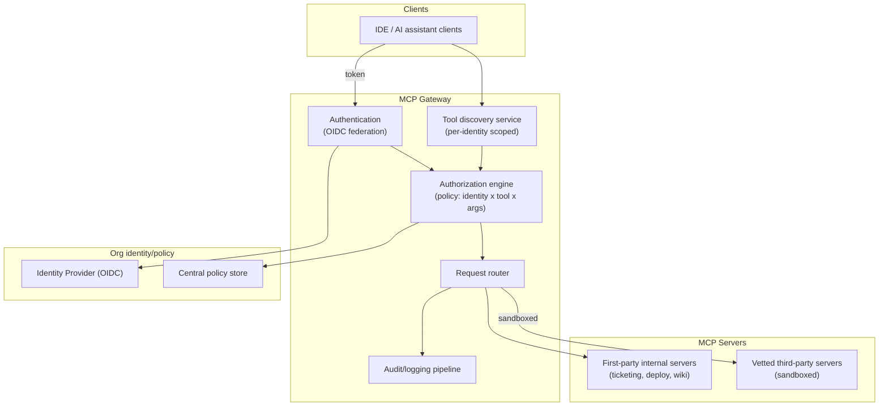

# Design an Enterprise MCP Gateway

**DIFFICULTY:** 🔴 Staff
**ROLE:** AI Platform Engineer, AI Security Engineer, Solutions Architect

> This case study is the full system-design treatment of the scenario
> discussed at the authorization/tool-discovery level in
> [`ai-engineering/mcp/senior-scenarios.md`](../../ai-engineering/mcp/senior-scenarios.md)
> — read that first for the authorization reasoning; this focuses on the
> overall system architecture.

## Requirements

**Functional:** route MCP client sessions (from AI assistants/IDE
integrations/internal apps) to the correct backend MCP servers; enforce
per-identity, per-tool authorization; support both first-party internal
tools and vetted third-party MCP servers; full audit of every tool
invocation.

**Non-functional:** low added latency per tool call (this sits in the
critical path of every agentic action); high availability (an outage
here breaks every AI-assisted workflow org-wide); horizontal scalability
to tens of thousands of concurrent developer sessions.

## Scale estimate

10,000 developers, assume a meaningful fraction actively using AI
assistants concurrently during work hours — low-thousands of concurrent
sessions, each potentially issuing several tool calls per minute during
active use.

## High-level architecture

## Data model

- **Identity → policy binding**: which tools/servers a given identity
  (human or service) may discover and invoke, sourced from the org's
  existing RBAC where possible rather than a parallel permission system.
- **Tool registry**: server metadata, tool schemas, trust tier
  (first-party vs. vetted-third-party), risk classification
  (read-only vs. side-effecting).
- **Audit record**: identity, tool, arguments, result, timestamp, session
  context — append-only, shipped to a separate system.

## APIs

- Discovery: `GET /tools` — returns the tool set visible to the calling
  identity, already filtered by policy (per the discussion in the linked
  MCP scenario doc — under-authorized tools aren't just blocked at
  invocation, they're not even listed).
- Invocation: `POST /tools/<tool>/invoke` — policy-checked before
  forwarding to the backend MCP server.

## Networking

Internal-only gateway; mTLS between gateway and backend MCP servers;
third-party servers isolated in their own network segment/sandbox with no
direct access to internal systems beyond what their specific tool
integration requires.

## Security

Covered in depth in
[`ai-engineering/mcp/security.md`](../../ai-engineering/mcp/security.md) —
key points: authorization enforced at the gateway (never trusting the
model's own restraint), tool-description integrity checks for poisoning,
human-in-the-loop for high-risk side-effecting tools, sandboxing for
third-party servers.

## Reliability

Gateway deployed as a horizontally-scaled, stateless service (session
state and policy live in backing stores, not gateway instance memory) so
individual instance failure doesn't drop sessions; policy store replicated
with a bounded staleness SLO (a stale authorization cache after a
permission revocation is a real security risk, not just a reliability
concern — see the trade-off note in the linked scenario doc).

## Observability

Full tool-invocation audit trail (per Data model above); latency tracking
per backend server (a slow third-party server shouldn't silently degrade
every user's experience without being visible); anomaly detection on
invocation patterns.

## Scaling

Stateless gateway layer scales horizontally behind a load balancer;
policy/discovery lookups cached aggressively (short TTL, invalidated on
policy change) since they're the highest-frequency read path.

## Cost

Dominant cost is the gateway's own compute (proportional to tool-call
volume, generally modest relative to the LLM inference costs happening
elsewhere in the overall AI system) plus third-party server hosting if
self-hosting vetted community servers rather than connecting to
externally-hosted ones.

## Failure modes

- **Stale authorization after a permission revocation**: bound the
  policy-cache TTL deliberately based on acceptable risk window, not
  convenience.
- **A single slow/misbehaving third-party server degrading overall
  latency**: per-backend timeouts and circuit-breaking so one bad server
  doesn't cascade.
- **Gateway itself becomes the outage**: the concentration-of-control
  trade-off named explicitly in the linked scenario doc.

## Trade-offs

Centralizing through one gateway (governance, consistent authorization)
vs. allowing direct client-to-server connections (lower latency, no
single point of failure, but no consistent enforcement) — the security
requirements at this scale make centralization the right default, with
the gateway's own availability engineering absorbing the resulting risk
concentration.

## Follow-up questions

- How would you roll out a new, stricter authorization policy without
  breaking existing workflows that relied on the looser previous policy?
- How would you support an autonomous agent (not a human-driven IDE
  session) that needs standing tool access rather than per-session
  authorization?
- What's your approach to onboarding a new third-party MCP server —
  what's the actual vetting process before it's added to the registry?
