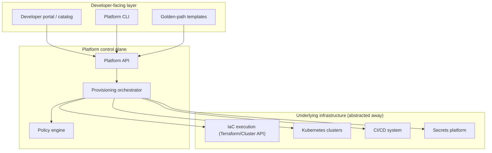

# Design an Internal Developer Platform (IDP)

**DIFFICULTY:** 🔴 Staff
**ROLE:** Platform Engineer, Solutions Architect

## Requirements

**Functional:** self-service provisioning of new services (repo, CI/CD
pipeline, cloud infrastructure, Kubernetes namespace) via a golden path;
a developer-facing catalog of what exists and who owns it; enforce
organizational policy (security, cost, compliance baselines) without every
team needing to understand the underlying infrastructure.

**Non-functional:** provisioning a new service should take minutes, not
the multi-day/multi-ticket process it's replacing; the platform itself
needs to scale to hundreds of engineering teams without the platform team
becoming a bottleneck.

## Scale estimate

Assume ~300 engineering teams, each owning several services — low
thousands of services total, with new-service creation happening
regularly (not a rare event) if the platform is actually succeeding at
its self-service goal.

## High-level architecture

## Data model

- **Service catalog entry**: owning team, golden-path template used,
  environment(s), dependencies, on-call/ownership metadata — this is what
  makes "who owns this and how was it built" answerable at scale instead
  of tribal knowledge.
- **Golden-path template**: versioned, parameterized definition of "a
  standard service" (repo structure, CI pipeline, infra shape) —
  analogous to the Cluster API "cluster class" pattern discussed in the
  120-cluster fleet scenario in `kubernetes/senior-scenarios.md`, applied
  to whole services instead of clusters.
- **Policy**: the compliance/security/cost baseline every provisioned
  service must satisfy, enforced by the orchestrator at provisioning time
  and continuously afterward (drift detection), not just as a one-time
  gate.

## APIs

- `POST /services` — provision a new service from a golden-path template.
- `GET /catalog` — the queryable service catalog (ownership, dependencies,
  health).
- Template authoring is itself a first-class workflow — platform teams
  (or empowered application teams, depending on the org's platform
  maturity) can publish new golden paths without the core platform team
  being a bottleneck for every template.

## Networking / Security

Provisioned services inherit the org's baseline security posture
automatically (NetworkPolicy defaults, secrets integration, identity
setup) as part of what the golden path provides — the platform's actual
security value is that teams get a secure-by-default starting point
without needing to correctly configure a dozen underlying systems
themselves.

## Reliability

The control plane's availability directly gates whether teams can
provision or modify services — design it with the same rigor as any other
critical-path platform service (see the Secrets Management Platform case
study for the general pattern of "this being down blocks everyone").
Existing provisioned services should **continue running** even if the
platform control plane is temporarily unavailable — provisioning being
down is degraded, not a full outage of already-running services.

## Observability

Platform-level metrics: time-to-first-deploy for a new service (a genuine
signal of whether the platform is actually reducing friction), golden-path
adoption rate versus teams bypassing it, policy-compliance rate across the
fleet.

## Scaling

The orchestration layer needs to handle concurrent provisioning requests
across many teams without serializing on a single bottleneck — the
underlying IaC execution (Terraform, Cluster API) is naturally
parallelizable per-service, which the orchestrator should exploit rather
than processing requests strictly sequentially.

## Cost

Cost visibility and attribution (per-team, per-service) should be a
platform feature, not a separate FinOps afterthought bolted on later —
see [`platform-engineering/finops/`](../../platform-engineering/finops/README.md).

## Failure modes

- **Golden path too rigid**: teams with genuinely unusual requirements
  either can't use the platform (defeats the purpose) or fight the
  abstraction (defeats the safety/consistency benefit) — needs an
  explicit, supported "escape hatch" path with appropriate additional
  review, not a hard wall.
- **Platform becomes a ticket queue**: if "self-service" actually routes
  through the platform team for approval on everything, it's not
  self-service — this is the literal scenario named in the
  `platform-engineer.md` learning path's key interview question ("when
  does Platform Engineering become another ticket-based Ops team?").

## Trade-offs

Standardization (golden paths, consistent tooling) vs. flexibility (teams
with genuinely different needs) — the platform's actual product-management
job is deciding where that line sits and revisiting it as the
organization's needs change, not picking one extreme permanently.

## Follow-up questions

- How do you measure whether this platform is actually succeeding, beyond
  "services got created"?
- How would you migrate the 300 teams' worth of existing, pre-platform
  services onto the golden paths without a disruptive forced migration?
- What's your model for a team that needs infrastructure the golden paths
  don't yet support — how fast can a new golden path go from request to
  available?
