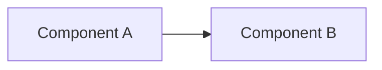

# Architecture Deep-Dive Template

Use for a full worked architecture flow (see
`ai-engineering/mcp/README.md`'s linked case study, and
`architecture/rag/` for three fully worked examples using this exact
shape at increasing complexity — basic, enterprise, agentic).

---

# [Title — e.g. "Enterprise RAG Architecture"]

**Problem:** [What need this architecture actually addresses — one or two
sentences, not a restatement of the title.]

**Requirements:** [Functional and non-functional, explicitly separated.]

**Assumptions:** [What's assumed given/fixed, so the reader knows the
scope — e.g. "assumes an existing identity provider," "assumes single
region."]

**Architecture diagram:**

**Request flow:** [Walk the diagram step by step in prose — what actually
happens, in order, for one representative request.]

**Components:** [What each box in the diagram actually is/does, briefly —
one line each is fine if the request flow above already did the real
explaining.]

**Networking:** [Trust boundaries, what's internal vs. external-facing.]

**Security:** [Authn/authz, and anything specific to this architecture's
actual risk surface — not a generic security checklist.]

**Data flow:** [What data moves where, and any transformation/sensitivity
along the way.]

**Observability:** [What you'd actually monitor/alert on for this
specific system.]

**Scaling:** [The actual bottleneck(s) and how they're addressed.]

**Reliability:** [Failure domains, redundancy, degraded-mode behavior.]

**Cost:** [What actually drives cost here.]

**Failure modes:** [Named specifically, with what breaks and what the
user-visible symptom would be.]

**Trade-offs:** [What this design chose *not* to do, and why that's
defensible.]

**Alternative architecture:** [At least one genuinely different approach,
briefly, and why this document's approach was chosen over it.]

**Interview questions:** [3-5 questions this architecture would naturally
generate as follow-ups in an interview.]
